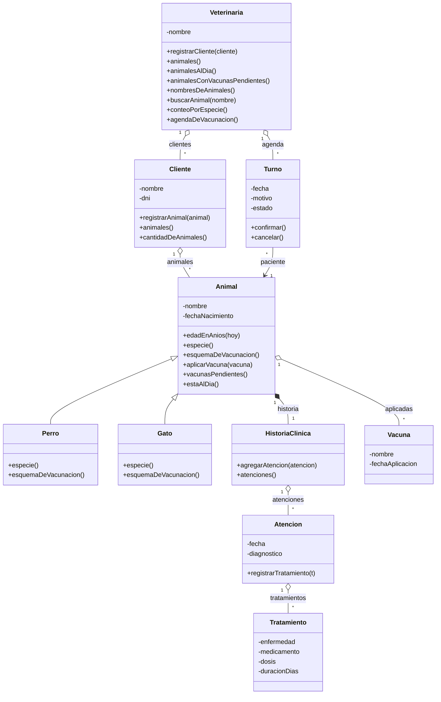
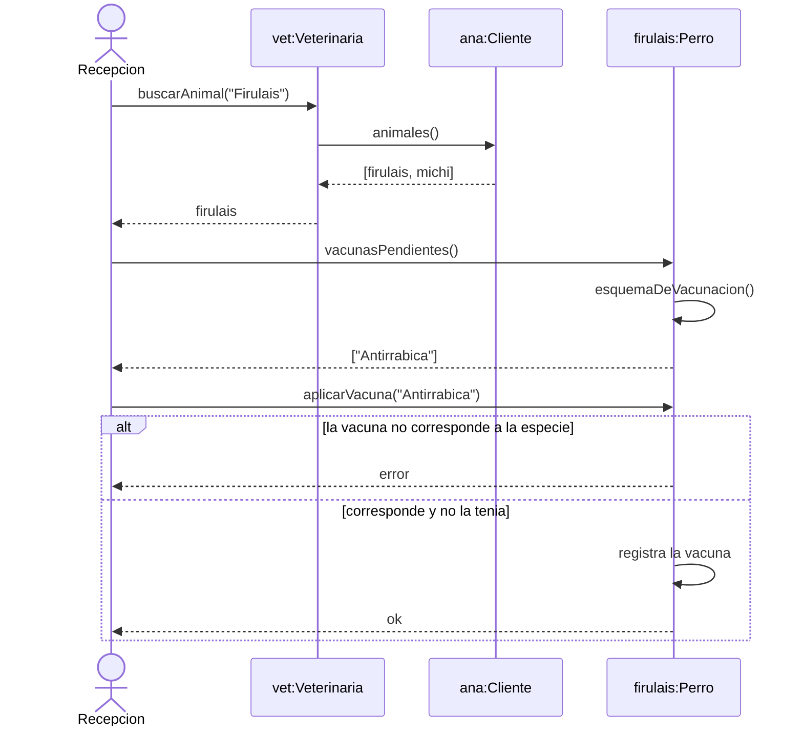

# Modelo

Diagramas del dominio de VetSoft, en Mermaid. GitHub los dibuja al abrir este archivo.

El diagrama modela el negocio completo; el código implementa solo el alcance comprometido.
Que el modelo sea más grande que la implementación no es un error: es la diferencia entre
entender el dominio y entregar un incremento.

## Diagrama de clases

| Clase | ¿Se implementa? | Por qué está |
|---|---|---|
| `Veterinaria` | Sí | Agregado raíz. Donde viven los recorridos de colección. |
| `Cliente` | Sí | Dueño de los animales. Asociación uno a muchos. |
| `Animal` | Sí | Clase base. |
| `Perro` | Sí | Subclase: esquema de vacunación propio. |
| `Gato` | Sí | Subclase: esquema de vacunación propio. |
| `HistoriaClinica` | No | Composición con `Animal`: no tiene sentido sin su animal. |
| `Atencion` | No | Una visita a la clínica. |
| `Tratamiento` | No | Lo indicado en una atención. |
| `Vacuna` | No | Registro de aplicación con fecha. |
| `Turno` | No | Agenda de la clínica. |

Tres decisiones del modelo:

- `Veterinaria o-- Cliente`: **agregación**, porque un cliente existe aunque cierre la veterinaria.
- `Animal *-- HistoriaClinica`: **composición**, porque la historia clínica no existe sin su animal.
- `Animal <|-- Perro`: **herencia**, justificada porque cada especie tiene un esquema de vacunación distinto.

## Diagrama de secuencia: vacunar a un animal

Incluye **autodelegación** (`esquemaDeVacunacion()` sale y vuelve al mismo objeto) y una
**condición** con `alt`.

